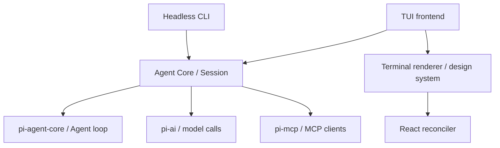

# Neant 架构

本文是当前运行架构的参考：先说明组合与依赖，再说明 Session、Run、持久化和扩展位置。修改 `apps/` 或 `packages/` 前阅读本文；领域定义以 [CONTEXT.md](../CONTEXT.md) 为准，决策与取舍见 [ADRs](adr/)，编写规则见 [AGENTS.md](AGENTS.md)。

## 运行组成

Neant 的 Headless CLI 与 TUI 都运行在 Bun 中，直接调用 `@neant/agent`。Agent Core 通过 `createSession` 组合模型、pi Agent loop、工具、权限、hooks、MCP、上下文与存储。Session 是 frontend 使用的运行接口，frontend 负责输入和呈现。

pi-agent-core 提供 Agent loop 及可复用的 harness 能力，pi-ai 提供模型协议与流式调用，pi-mcp 提供 MCP 客户端。Neant 的组合入口与应用规则位于自身模块中；它们的责任分界由 [ADR-0002](adr/0002-reuse-pi-agent-core-harness.md) 规定。

下面的箭头表示导入或调用依赖，公共类型与本地化能力另列在表中。



| 包                 | 在运行组合中的责任                                                              |
| ------------------ | ------------------------------------------------------------------------------- |
| `@neant/neant-cli` | 解析非交互输入，驱动一次用户 Run，输出文本或 Session 事件的 stream-json 表示    |
| `@neant/neant-tui` | 连接 Session、交互回调和终端界面，管理呈现状态、Slash Command、输入历史与本地化 |
| `@neant/agent`     | 执行 frontend 无关的 Session 行为，协调模型、工具、Transcript 与 Run 资源       |
| `@neant/tui`       | 处理终端输入、React 宿主树、布局、绘制、滚动及终端恢复                          |
| `@neant/shared`    | 提供运行时无关的公共类型、schema 与纯函数；不依赖 Agent Core 或 frontend        |
| `@neant/i18n`      | 提供运行时无关的通用文案与 locale 能力，只依赖 shared；frontend 提供自己的字典  |

内部包直接导出 TypeScript 源码，消费者通过工作区包名导入。具体依赖与脚本由各包 `package.json` 定义；技术版本由 [tech-stack.md](tech-stack.md) 维护。

## 应用启动与 Session

Headless CLI 从[入口](../apps/neant-cli/src/main.ts)解析 argv 或 stdin，读取合并设置、创建或恢复 Session，调用 `Session.run`，再输出结果并释放 Session。它不提供 Interaction 回调：依赖回调的工具不进入模型工具集；权限询问等 Agent Core 请求采用安全默认值。

TUI 从[入口](../apps/neant-tui/src/main.tsx)解析参数与 locale，建立[聊天界面](../apps/neant-tui/src/screens/chat/index.tsx)，为 Session 提供权限、问题与计划评审回调。界面在同一 Session 中接收多次输入；切换 Session 时释放旧的绑定，重建对话呈现，项目输入历史独立保留。

[`createSession`](../packages/agent/src/session/index.ts)解析工作目录、创建或打开存储、投影当前分支，并恢复模型选择、Plan Mode、Tool State 与对话上下文。指定的恢复目标不存在或父子归属不符时失败，不改为新建 Session。Session Resume 重建已保存的事实，本身不续跑历史 Subagent。

Session 对 frontend 暴露运行、事件订阅、中断、steer、上下文查询、compaction、Rewind 等能力；完整接口由源码定义。`run` 的 `onEvent` 接收该次 Run 的有序事件，`subscribe` 观察 Session 中包括 Hook 内部续跑在内的事件；TUI 通过订阅跟踪持续变化。

## Agent Core 的职责分配

| 模块                                                      | 责任                                                            |
| --------------------------------------------------------- | --------------------------------------------------------------- |
| `session/`                                                | 组合能力、协调 Run、事件、取消、存储操作与 frontend 接口        |
| `config/`、`prompt/`                                      | 合并设置、解析模型与凭据，建立 System Prompt                    |
| `tools/`、`skills/`、`mcp/`                               | 构造模型工具集、加载 Skill 内容、连接外部工具                   |
| `permissions/`、`review/`、`hooks/`、`interaction/`       | 决定执行是否允许，运行生命周期扩展，并协调可取消的用户交互      |
| `reminders/`、`compaction/`、`context-usage/`             | 注入有来源的上下文、压缩模型历史、报告上下文占用                |
| `store/`、`tool-state/`、`checkpoint/`                    | 持久化 Transcript、重建工具状态、保存和恢复文件修改前的内容     |
| `subagents/`、`session-resume/`、`unknown-tool-outcomes/` | 管理子 Session 与 Run，核对恢复事实，处理缺少确定结果的工具调用 |
| `session-title/`、`plan-mode/`、`side-question/`          | 管理标题、计划引导与独立侧问                                    |

模块之间通过各自 `index.ts` 协作；frontend 使用包级公开入口，不读取 Agent Core 的私有运行状态。

## Run 与 Turn 流程

Run 处理一条 prompt，包含一次或多次 Turn；每个 Turn 是一次模型调用及其返回的工具调用。这个划分沿用 Neant 领域定义。一个 Session 同时只有一个执行中的 Run；用户输入与 Hook 内部 Run 的竞争由 Session 协调。

```text
frontend prompt / Hook 内部输入
  → 接入取消信号，建立本次 Run 的资源和事件通道
  → 连接 MCP，发现当前工具、Skill 与 Subagent 类型
  → 执行输入相关 Hook，打开存储，收集 System Reminder
  → pi Agent.prompt
      → 请求前处理上下文、Compaction 与当前 Plan Mode 引导
      → 模型流式响应；消息完成后追加到 Transcript
      → 工具参数准备与校验
      → hooks / 权限规则 / Permission Mode / 用户交互
      → 执行工具，处理工具结束 Hook，记录工具结果
      → 后续 Turn，直到 pi loop 暂停
  → 接收子代理通知或等待运行中的子代理，需要时继续模型调用
  → Stop / SubagentStop Hook 决定结束或提供继续输入
  → 收敛子代理与待写状态，关闭本次存储和 MCP，等待权限评审清理
  → 发布 result，解除运行占用
```

Session 在 pi 的请求准备、工具前后回调和消息事件上接入这些行为。模型流式增量用于实时呈现，完成消息用于 Transcript 追加；frontend 收到的所有运行事件并不都作为持久化条目保存。

中断通过 AbortSignal 传播到模型、工具与挂起的 Interaction。清理在成功、失败和取消路径上执行；已完成的消息与状态写入使用独立的存储上下文，不因 Run 已取消而跳过。`result` 位于本次资源清理之后。`dispose` 释放 Session 资源，但不能一律等待调用它的 Run；frontend 关闭时还要从 Run 回调之外等待运行收束，使用 `waitForIdle` 或已有的 Run Promise，避免等待自己的回调。

Hooks 可以向下一次请求提供上下文、阻止工具或结束 Run，也可以在停止阶段要求继续。异步 Hook 的 `asyncRewake` 能向进行中的 Run steer，或在空闲时启动内部 Run；所以 frontend 不能仅以自己调用过的 `run` 判断 Session 是否正在执行。完整 Hook 协议与限制见 [hooks.md](hooks.md)。

## 工具、权限与交互

内置工具经适配连接 pi 的执行环境与 Neant 的 AbortSignal；Skill 加载工具、结构化提问、Todo、计划评审与 Subagent 工具在各自模块组装。MCP 发现的工具也转换为同一种 AgentTool，再进入共同的授权流程。完整工具声明以构造模块和当前运行发现结果为准。

权限执行入口是 pi 的 `beforeToolCall`。它协调 Hook、显式规则、Permission Mode 和必要的 frontend 询问；Hook 改写的输入重新校验，路径匹配与实际执行使用同一规范化目标。显式 deny/ask 不被 full-access 或 Hook allow 越过。规则语法、顺序及限制由 [permission-rules.md](permission-rules.md) 维护。

auto-review 通过独立模型调用判断权限；评审拒绝或失败转为用户询问。Plan Mode 控制模型的计划引导与评审流程，并不限制可执行工具，也不替代权限判定。二者的决策见 [ADR-0007](adr/0007-auto-review-llm-only.md) 和领域词汇表。

Interaction 由 Agent Core 发起，frontend 提供响应回调。[`interaction/`](../packages/agent/src/interaction/index.ts)协调回复与取消：Run 中止后返回该交互的取消结果，晚到回复不能恢复授权。交互的运行中状态属于 frontend 与当前进程，结果通过对应工具消息体现。

## 模型上下文

System Prompt 提供固定行为指令；System Reminder 承载日期、项目说明、Skill 目录或正文、MCP 描述以及其他有来源的上下文。项目说明优先读取 `AGENTS.md`，缺失时读取 `CLAUDE.md`。[`reminders/`](../packages/agent/src/reminders/index.ts)按来源与最近持久化内容比较，仅追加需要更新的提醒，并在模型调用处转换自定义消息。

Compaction 在请求前自动检查，也可由空闲 Session 手动执行。它追加原生 compaction 记录，模型上下文由 System Prompt、摘要、保留尾部与之后的消息重建；原始 Transcript 仍保留。压缩后重新建立当前提醒来源，后续请求和恢复走相同的上下文投影。

`Session.messages` 表示当前恢复或压缩后的模型上下文，不是完整 Transcript 的同义词。Context Usage 与 Context Report 是观测结果，不追加为模型内容；实际 provider 用量与分类估算的区别见 `CONTEXT.md`。Side Question 使用独立、无工具的单轮调用，不修改主 Run 或 Transcript。

## Transcript、Tool State 与 Rewind

[`store/`](../packages/agent/src/store/index.ts)把 pi 的原生 JSONL repo 接入 SessionStore，提供创建、打开和枚举，并支持定向查询及只读观察。存储格式与选型见 [ADR-0003](adr/0003-dual-session-store.md)。存储位置、项目 slug 与文件命名由这个实现及 pi 管理，架构不维护第二份命名规则。

当前分支包含消息、compaction 和自定义 Tool State 记录。Tool State 按名称与版本校验完整快照，重放时取该分支最后一条有效值；无效记录告警并跳过。Todo、计划状态、模型选择和子代理身份等通过这条路径恢复，Permission Mode 与临时 session allow 规则保留在内存中。

Checkpoint 在真实用户 prompt 上建立锚点，记录文件工具首次修改前的原样内容；子代理共用父 Session 的记录器。它不记录 bash 或 MCP 的文件副作用。Rewind 仅在空闲时恢复文件和/或对话：对话恢复保留原分支，再移动 `main` 到锚点之前，并重建上下文与 Tool State。文件恢复可能覆盖之后的修改；定义与使用限制由 `CONTEXT.md` 和 [`checkpoint/`](../packages/agent/src/checkpoint/index.ts)负责。

恢复遇到只有调用而没有确定结果的工具时，将其作为 Unknown Tool Outcome 处理。它既不能证明调用失败，也不能证明尚未执行；恢复不能据此重放可能产生副作用的操作。

## Subagent 的运行与恢复

父 Session 创建子 Session 来执行委派输入：`subagent` 从空历史开始，`subagent_fork` 带入父代理已完成的 Turn，`send_message` 可以续跑同一子 Session。子代理共享父级权限与 Plan Mode，类型配置只能收窄能力，子代理不能再创建子代理。

子 Run 默认后台执行，事件带子代理身份转给父级观察者；结束通知作为消息交回父模型。父 Run 在子代理仍运行时等待，收到通知后继续。子 Run 的结束原因是持久化事实，委派任务是否完成仍需父代理根据工作结果判断。

Session Resume 通过只读观察核对子 Run 与父子归属，不自动恢复运行。缺少足够证据时报告未知，而不是把进程不活跃解释成任务完成。恢复摘要在后续输入中提供给模型，父代理可以决定用原 id 续跑。完整恢复决定见 [ADR-0009](adr/0009-subagent-resume-outcomes.md)。

## TUI 与本地化

TUI 的 screens 连接 Session 与应用状态，components 接收 props 并呈现 Neant 语义；design system 和 renderer primitives 不依赖 Agent Core。Slash Command 由 frontend 解析，未匹配输入交回 Agent Core；命令语法不进入 Session 的领域接口。

终端管线是 React reconciler → 纯 TypeScript Yoga 布局 → cell 网格 → 帧差分 → ANSI。只有 layout 使用 vendored Yoga；渲染器支持注入 stdin/stdout。通用终端 API、绘制、输入与清理语义由 [renderer README](../packages/tui/README.md)维护，来源与复用决定见 [ADR-0005](adr/0005-own-tui-renderer.md)。

TUI 使用 alternate screen，消息区独立滚动，输入与交互区固定底部；应用管理阅读位置、跟随和面板组合，渲染器负责终端模式与光标恢复。全屏行为和项目输入历史见 [ADR-0006](adr/0006-fullscreen-tui.md)。输入历史不属于模型上下文或 Transcript。

Agent Core 不读取 locale，它构造的模型工具文本固定英文，面向用户的错误以类型化错误码与参数交给 frontend。frontend 选择 locale，组合 i18n 通用字典和自己的文案，并渲染错误及交互选项；TUI 注入的 narration 提醒属于 frontend 文案。Transcript 保留当时原文，恢复时不重新翻译。通用 key 不被应用覆盖，责任分界见 [ADR-0008](adr/0008-locale-agnostic-agent-core.md)。

## 配置与信任

用户设置与项目设置由 [`config/`](../packages/agent/src/config/index.ts)合并并校验；模型解析和凭据读取也由它负责。项目不能定义 provider、覆盖用户 locale 或默认 Permission Mode，也不能声明自身受信任。项目 allow 规则与 hooks 只在用户声明的 Trusted Project 中加载。

MCP 用户配置始终参与发现；项目 `.mcp.json` 在项目受信任或用户明确授权该 MCP 配置时加载。MCP 连接属于一次 Run：每次重新发现当前能力，结束时关闭；这个单独的 MCP 授权不放开项目 hooks 或项目 allow 规则。

这些规则控制配置来源和工具授权，不提供进程或文件系统沙箱。所有 frontend 与工具扩展都要保持凭据来源、显式拒绝、取消及执行目标的一致性。

## 新行为的落点

| 需求                       | 所有者与接入方式                                                                |
| -------------------------- | ------------------------------------------------------------------------------- |
| 增加模型或 provider 配置   | `config/` 的模型解析与 pi-ai 调用；同步配置 schema 和对应错误文案               |
| 增加模型工具               | 所属能力模块和 `tools/` 或 Session 工具组装；接入统一权限、取消和结果持久化     |
| 注入模型上下文             | `ReminderSource` 与 `reminders/`；需要长期保留的状态经 Tool State 生成提醒      |
| 增加持久化状态             | 所属模块声明 Tool State，`tool-state/` 校验与重放，Session 连接写入和事件       |
| 调整权限或生命周期 Hook    | `permissions/`、`hooks/`；保持相应专项文档同步                                  |
| 增加交互                   | Agent Core 声明回调与取消行为，frontend 连接交互呈现，并覆盖无回调场景          |
| 增加 frontend 或存储后端   | 消费公开 Session 接口或实现 SessionStore；运行与存储约束参照 ADR-0001、ADR-0003 |
| 增加 TUI 命令或 Neant 面板 | `apps/neant-tui` 的命令、screen 与 components；复用通用终端原语                 |
| 增加通用终端能力           | `packages/tui`，保持 Agent Core 无关，并更新 renderer README                    |

接口声明留在源码，局部能力细节留在所属文档。改变运行组合、Run 完成条件、持久化投影或跨包职责时，同步更新本图谱及相关 ADR；验证入口和测试约定见[根 AGENTS.md](../AGENTS.md)。
