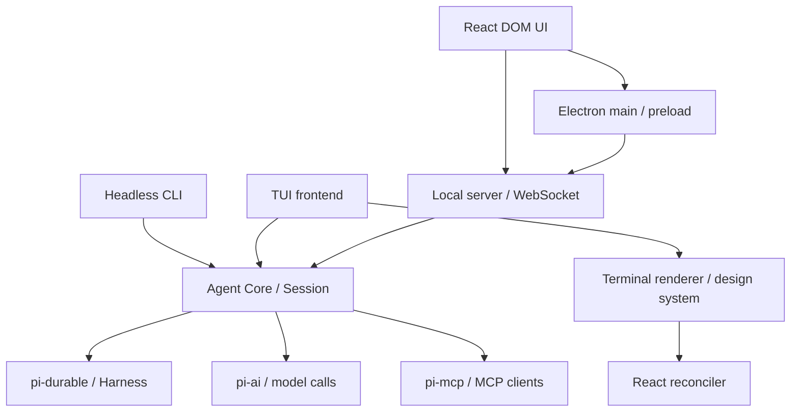

# Rukie 架构

本文是当前运行架构的参考：先说明组合与依赖，再说明 Session、Run、持久化和扩展位置。修改 `packages/` 前阅读本文；领域定义以 [CONTEXT.md](../CONTEXT.md) 为准，决策与取舍见 [ADRs](adr/)，编写规则见 [AGENTS.md](AGENTS.md)。

## 运行组成

Rukie 的 Headless CLI、TUI 与桌面端本机 server 都运行在 Bun 中，直接调用 `@rukie/agent`。桌面界面运行在 Electron renderer 或浏览器中，经带鉴权的 WebSocket 调用本机 server；Electron main 负责窗口、宿主操作与 Bun sidecar 生命周期。Agent Core 通过 `createSession` 组合原生 Harness、模型、工具、权限、hooks、MCP、上下文与存储。Session 是 frontend 使用的运行接口，frontend 负责输入和呈现。

pi-durable 拥有 Generation、ToolTask、Conversation、Submission、ownership、原子提交与恢复；pi-ai 提供模型协议，pi-mcp 提供 MCP 客户端。Rukie 的配置、授权、能力状态和宿主资源由所属模块维护，Session 负责组合；责任边界见 [ADR-0024](adr/0024-adopt-pi-durable-harness.md)。

下面的箭头表示导入或调用依赖，公共类型与本地化能力另列在表中。



| 包                    | 在运行组合中的责任                                                                                             |
| --------------------- | -------------------------------------------------------------------------------------------------------------- |
| `@rukie/coding-agent` | `headless/` 驱动非交互 Run 与 Goal，`tui/` 管理交互与呈现，`view/` 负责终端无关的呈现投影，`ink/` 负责终端渲染 |
| `@rukie/agent`        | 执行 frontend 无关的 Session 行为，协调模型、工具、Transcript 与 Run 资源                                      |
| `@rukie/shared`       | 提供运行时无关的公共类型、schema 与纯函数                                                                      |
| `@rukie/i18n`         | 提供运行时无关的通用文案与 locale 能力，只依赖 shared                                                          |

桌面端分为 `@rukie/ui`、`@rukie/server`、`@rukie/desktop` 三个 workspace。ui 的 app/components/store/client/host 分层由 lint 约束，组件消费呈现数据，client 处理连接和 wire 协议，host 提供本机操作接口。server 校验 shared 的 TypeBox wire 命令，并通过公开 Session API 管理执行和订阅；Effect 只用于 server 内部编排。desktop 通过 preload 注入 host，并管理 sidecar 与 `app://rukie` 的静态资源。包方向见 [ADR-0029](adr/0029-desktop-package-structure.md)，测试运行时见 [ADR-0004](adr/0004-test-runner-per-runtime.md)。

公共内部包直接导出 TypeScript 源码，跨包消费者通过工作区包名导入；coding-agent 包内使用相对路径，TUI 只经 `ink/index.ts` 使用终端能力。桌面端的宿主与资源生命周期见 [desktop README](../packages/desktop/README.md)，网络入口与注册表见 [server README](../packages/server/README.md)，窗口接线与浏览器开发入口见 [ui README](../packages/ui/README.md)。具体依赖与脚本由各包 `package.json` 定义；技术版本由 [tech-stack.md](tech-stack.md) 维护。

## 应用启动与 Session

[`main`](../packages/coding-agent/src/main.ts) 用 [`cli/`](../packages/coding-agent/src/cli/index.ts) 的一份参数表解析并校验 argv，按模式动态加载 Frontend。`rukie` 与 `rukie "问题"` 启动 TUI；后者自动提交首条 prompt。`rukie -p "问题"`、`cat x | rukie -p` 或 `rukie --goal "目标"` 启动 Headless CLI；`-p` / `--print` 是布尔开关，prompt 来自位置参数，缺省时读取 stdin。不带 print / goal 且 stdin 非 TTY 时返回 2，并提示使用 `-p`。参数错误依据启动环境的 locale 显示。`--output-format` 与 `--max-goal-rounds` 仅用于 Headless 模式；rounds 还要求 `--goal`。Headless 启动不加载 React 或终端 renderer。

Headless CLI 的 [`runHeadless`](../packages/coding-agent/src/headless/main.ts) 读取合并设置，创建或恢复 Session。普通 prompt 调用 `Session.run`；Goal 调用 `Session.createGoal`，随后沿 `waitForRequest` 等待关联后台任务和报告处理，再关闭 Session。`--goal` 与 `-p` / `--print` 互斥，也不接受额外的 prompt。Goal 完成退出 0，受阻或达到轮次上限退出 1；恢复到已有未完成 Goal 的 Session 时拒绝覆盖，用户通过 TUI 处理。它不提供 Interaction 回调：依赖回调的工具不进入模型工具集；权限询问等 Agent Core 请求采用安全默认值。

TUI 的 [`runTui`](../packages/coding-agent/src/tui/main.tsx) 建立[聊天界面](../packages/coding-agent/src/tui/screens/chat/index.tsx)，为 Session 提供权限、问题与计划评审回调。界面在同一 Session 中接收多次输入；切换 Session 时释放旧的绑定，重建对话呈现，项目输入历史独立保留。stdout 非 TTY 或 TERM 为 dumb 时仍由 TUI 拒绝启动并返回 1。公开包入口导出 `main` 与 IO 类型；IO 可使用终端流，或在 Headless 调用中注入 stdout 回调和异步 stdin 读取。

TUI 退出时先恢复终端并等待 Session 保存、资源释放，再显示当前 Session 的 `rukie --resume <id>` 命令。在原项目目录执行该命令可继续会话；通过 `/new` 或会话选择器切换后，提示使用退出时的 Session。信号中断也显示恢复命令；尚未创建 Session 的启动失败不显示。

[`createSession`](../packages/agent/src/session/index.ts)解析工作目录、创建或打开存储、投影选中 Conversation，并恢复模型选择、Plan Mode、Tool State 与对话上下文。指定的恢复目标不存在或父子归属不符时失败，不改为新建 Session。Session Resume 恢复已接受而未结算的原生工作，包括后台 Subagent 和 reporter；历史身份与已结束事实不创建新工作。

Session 对 frontend 暴露运行、事件订阅、中断、steer、Goal、上下文查询、compaction、Rewind 等能力；完整接口由源码定义。`run` 的 `onEvent` 在调用期间观察 Session 事件，`subscribe` 首先提供已提交 snapshot，再观察 native changes 与产品事件；TUI 持续订阅。父 Run 结果与 `request_settled` 是不同完成边界，输出合同见 [Headless README](../packages/coding-agent/src/headless/README.md)。

Session 的 Background Job registry 管理 Bash 进程组、输出和游标。显式后台或超时提升后向 Frontend 发布 `job_event`；完成通知在活跃 Run 内追加模型可见事实，空闲时通过原生 follow-up 提交。普通父 Run 结束不清理 Job，`session.close()` 终止宿主进程与输出；子 Run 按自身资源约束清理。Resume 不重建旧 OS 进程，但已提交的工具结果继续可读；durable Task 与 Background Job 分别观察。完整约定见 [Agent README](../packages/agent/README.md#background-job)。

## Agent Core 的职责分配

下表描述当前代码的落点。[ADR-0011](adr/0011-agent-module-ownership.md) 将 `tools/` 定义为内置工具及其关联能力的集合：按能力聚合协议适配、执行、状态与资源管理，Session 可以直接调用能力接口；[`session/tools.ts`](../packages/agent/src/session/tools.ts) 的 Tool Loadout 统一组装 root 与 child 工具、规划模型可见声明及发布 MCP drift，[`session/index.ts`](../packages/agent/src/session/index.ts) 连接能力与原生 Harness 生命周期。

| 模块                                                                           | 责任                                                                                                              |
| ------------------------------------------------------------------------------ | ----------------------------------------------------------------------------------------------------------------- |
| `session/`                                                                     | 组合能力、协调 Run、事件、取消、存储操作与 frontend 接口                                                          |
| [`requests/`](../packages/agent/src/requests/index.ts)                         | Request 身份、提交与任务绑定、因果结算、当前前台身份及启动恢复                                                    |
| [`session/conversation/`](../packages/agent/src/session/conversation/index.ts) | root 与 child 共享的权限、Tool Hook、Job 与文件跟踪运行时                                                         |
| [`session/tools.ts`](../packages/agent/src/session/tools.ts)                   | Tool Loadout 组装、声明差异、Deferred Tool 规划及 child 工具限制                                                  |
| [`tools/support/`](../packages/agent/src/tools/support/)                       | 工具路径规范化、运行时包装、preflight 与纯呈现支撑                                                                |
| `config/`、[`session/prompt.ts`](../packages/agent/src/session/prompt.ts)      | 合并设置、解析模型与凭据，提供共享 System Prompt                                                                  |
| `tools/`、`skills/`、`mcp/`                                                    | 构造模型工具集、发布精简 Skill 目录并按需加载正文、连接外部工具                                                   |
| [`tools/bash/`](../packages/agent/src/tools/bash/index.ts)                     | 执行 Bash 调用、后台启动与超时提升，拥有输出采集与截断                                                            |
| [`tools/tool-search/`](../packages/agent/src/tools/tool-search/index.ts)       | 拥有 Deferred Tool 启用判定、保留顺序规划、查询与名单 reminder 差异                                               |
| [`tools/jobs/`](../packages/agent/src/tools/jobs/index.ts)                     | 持有 Session 的 Bash 进程组、输出与模型游标，提供后台任务工具                                                     |
| [`images/`](../packages/agent/src/images/index.ts)                             | 为 Session 与 read 共享图片准入校验，读取 header metadata                                                         |
| `permissions/`、`hooks/`、`interaction/`                                       | 决定执行是否允许（含独立模型评审），运行生命周期扩展，并协调可取消的用户交互及 pending interaction 身份写入和识别 |
| `reminders/`、`context-usage/`                                                 | 注入有来源的上下文、报告原生 Compaction 后的上下文占用                                                            |
| `store/`、`tool-state/`、`checkpoint/`                                         | 接入原生 Storage 与 typed documents、保存和恢复文件修改前内容                                                     |
| `file-tracking/`                                                               | 跟踪文件工具的内容基线、检测外部变化、拒绝未经重读的过期写入                                                      |
| [`tools/subagents/`](../packages/agent/src/tools/subagents/index.ts)           | 管理 owned child、原生 driver/reporter、恢复与请求因果关联                                                        |
| `session-title/`、`side-question/`                                             | 管理标题与独立侧问                                                                                                |
| [`tools/plan-mode/`](../packages/agent/src/tools/plan-mode/index.ts)           | 管理 Plan Mode 快照、引导与 Enter/Exit 工具，Session 协调存储与状态事件                                           |
| [`tools/goal/`](../packages/agent/src/tools/goal/index.ts)                     | 管理 Goal 快照、激活校验、续跑 task、轮次与收尾，Session 注入提交与结算 adapter                                   |

模型 Hook 通过 [`tools/readonly.ts`](../packages/agent/src/tools/readonly.ts) 构造 read、glob、grep，只加载这些只读能力及 `tools/support/` 支撑，不加载完整内置工厂。`tools/builtin.ts` 保留为具体工具组装入口；read、write/edit、问题与 Skill 的协议适配仍归具体工具，不属于共享支撑。

Request Ledger 判定因果工作何时结算、持久化结果并发布一次 `request_settled`；结果组装是纯函数，Goal 与 Subagent 各自读取其 driver 回执。Hook stop 与 Plan takeover 按 Request 写入 Ledger，调用方在同一事务中追加 Notice；是否停止仍由 Conversation 的运行策略决定。

Conversation Runtime 为每个原生 Conversation 分别保存权限策略、Hook 与文件跟踪；逻辑 Subagent 的 Background Job owner 在空闲 `send_message` 创建新原生 Conversation 后继续复用。child Run 结算前清空 Job 和输出，保留该逻辑 owner 的 Job 序号，并将通知绑定到当前 Conversation。工具权限与 Hook 执行由 Conversation Runtime 统一处理，原生 Generation、Tool 与 Compaction hook 仍在 Session 的固定入口按顺序调用能力接口，能力不另注册这些 hook，见 [ADR-0028](adr/0028-single-session-harness-hook-entry.md)。

模块之间通过各自 `index.ts` 协作；frontend 使用包级公开入口，不读取 Agent Core 的私有运行状态。

## Run 与 Turn 流程

Run 是原生 Conversation 从接受输入到停止的一段执行，可在工具或最终边界纳入 inbox 中的新输入；每个 Turn 是一次模型调用及其返回的工具调用。同一 Conversation 只有一个普通 Run，owned background Conversation 可以独立运行。一次产品请求可包含多个 Run，因果结算由 `waitForRequest` 观察。

```text
Frontend / Hook / Goal / reporter 输入
  → 当前配置、可信项目、工具与输入 Hook
  → 原生 Submission 提交，确认后发布已接受事实
  → native Generation
      → 原生上下文、Compaction、当前能力与 beforeRequest
      → 模型请求与已提交 partial / assistant
      → native ToolTask 参数校验和 capability preflight
      → 当前权限 / Hook / 可取消 Interaction
      → 提交执行 intent，执行工具并提交结果
      → 下一 Turn 或原生 inbox / Stop continuation 边界
  → 父 Run 结束；background child 可以继续
  → 持久化 reporter 提交与后续处理
  → 产品请求结算；Frontend 输出终态并关闭宿主
```

Session 创建过程可以由 `initializationSignal` 取消 SessionStart Hook 和返回前的初始化；失败路径先撤销注册读者与 observation，再释放连接、Hook 和存储。原生 Harness 使用独立 BACKGROUND_CONTEXT；初始化信号在打开完成后不取消 Run。Frontends 的关闭、信号码与 renderer 完成义务分别见 [Headless](../packages/coding-agent/src/headless/README.md) 和 [TUI](../packages/coding-agent/src/tui/README.md)。

Tool View 的 schema 由 `@rukie/shared` 定义，工具在自身模块声明纯 presenter，Session 在工具开始与结束事件上附加调用或结果 view。`Session.messages` 为工具调用和结果重算 view；它只读取参数、结果与持久化 details，presenter 缺失、参数非法或抛错时省略 view，由 frontend 使用通用卡。View 不进入 Transcript，也不进入模型上下文。read 的截断声明与继续读取 offset、bash 的完整输出路径从持久化结果事实重算；frontend 将这些事实呈现于折叠正文之外。todo、question、plan 与 subagent 工具的 view 分类为 task；TUI 在建卡前仍分流到专用组件。

Session 以公开 extensions、hooks 和 observation 接入模型与工具事实。Frontend 消费一致 snapshot 和 committed changes；部分输出也是原生提交，不能把所有事件等同于 Transcript entries。慢观察者可收到替换 snapshot，按持久化身份替换呈现。

[`session/session-notice.ts`](../packages/agent/src/session/session-notice.ts) 保存模型不可见的 Hook 提示与产品停止事实；Frontend 按 Locale 解码。原生错误、Compaction 与未知工具结果保留其实际事实。unsafe intent 中断后不重新执行副作用，safe replay 还需当前定义与授权；不根据未知结果推断成败。存储失败向调用方传播，poisoned Session 须关闭再打开，恢复以原生提交为准，不制造成功或额外结束记录。SessionEnd 诊断与连接提示属于当前宿主生命周期。

普通 `abort()` 使用原生 Conversation 取消，默认不跨 background ownership；显式 child stop 等待所选 driver 终态。`close()` 撤回当前 invocation，保留已接受 pending work，并等待 Hook、连接、进程、observation 与租约收束。事件观察者可请求 close；关闭不通过等待自身 Run 回调制造自等待。正常退出和主动进程信号走 close，下一次打开才恢复，宿主关闭后无 daemon 继续执行。

Hooks 可以向下一次请求提供上下文、阻止工具或结束 Run，也可以在停止阶段要求继续。异步 Hook 的 `asyncRewake` 能向进行中的 Run steer，或在空闲时启动内部 Run；所以 frontend 不能仅以自己调用过的 `run` 判断 Session 是否正在执行。完整 Hook 协议与限制见 [hooks.md](hooks.md)。

Goal 只属于顶层 Session。用户通过 TUI `/goal`、Headless `--goal` 或模型工具 `create_goal` 设定目标；Goal 能力的原生 driver 在前一轮及相关 child/reporters 结算后提交下一轮；Human 输入、Hook continue 与通知沿原生 inbox 处理。只有带 Goal 来源的内部输入计入轮次，内部 round 与收尾消息不创建 Checkpoint、不用于标题，也不呈现为用户气泡。`update_goal` 完成或受阻会停止自动续跑，并在 Goal round 内向模型提供同一 Run 的收尾指令；出错、中止或 token 超限只停止自动续跑，保留 Goal 供用户恢复。Goal 不改变 Permission Mode。

## 工具、权限与交互

read/write/edit 经适配连接 pi 的执行环境与 Rukie 的 AbortSignal；bash 由 Session 的 job registry 启动独立进程组；前台调用等待完成，显式后台调用立即返回 id。Run 结束或取消保留后台任务，Session close 清理进程组与输出；终止先发 SIGTERM，3 秒后升级为 SIGKILL。后台工具的读取与生命周期见 [`tools/jobs/`](../packages/agent/README.md)。Skill 加载工具、结构化提问、Todo、计划评审与 Subagent 工具由所属能力模块构造，Session 按身份、子类型与当前 MCP 发现组装成运行工具集。MCP 发现的工具也转换为原生 ToolRegistration，再进入共同的授权流程。完整工具声明以构造模块和当前运行发现结果为准。

[`tools/tool-search/`](../packages/agent/src/tools/tool-search/index.ts) 区分完整可执行工具目录和模型当前可见的 loadout：MCP 工具注册保留，Deferred Tool 暂不提供声明，`ToolSearch` 命中后经原生 `ToolControl.addTools` 加载。Session 每次请求前协调当前配置、目录与 Transcript，保留仍有效声明的位置，只移除失效或变更的声明并追加新声明；晚出现的 `ToolSearch` 也追加在已有声明之后。pi-ai 根据模型 compat 使用原生追加格式或将当前已加载定义放入下一次请求的普通工具列表；原生追加路径可保留对话前缀。已发现集属于当前分支的 Transcript，不另立 Tool State；子 Session 使用自己的工具目录约束和 Transcript。配置、兼容条件与查询语法见 [MCP Tool Search](mcp.md#tool-search)，长期取舍见 [ADR-0025](adr/0025-client-side-tool-search.md) 与 [ADR-0026](adr/0026-protocol-independent-tool-search.md)。

权限能力在原生 `beforeTool` preflight 与实际执行路径检查当前决策；safe replay 不会绕过 execute 授权。它协调 Hook、显式规则、Permission Mode 和必要的 frontend 询问；Hook 改写的输入重新校验，路径匹配与实际执行使用同一规范化目标。显式 deny/ask 不被 full-access 或 Hook allow 越过。规则语法、顺序及限制由 [permission-rules.md](permission-rules.md) 维护。

auto-review 通过独立模型调用判断权限；评审拒绝或失败转为用户询问。Plan Mode 控制模型的计划引导与评审流程，并不限制可执行工具，也不替代权限判定。二者的决策见 [ADR-0007](adr/0007-auto-review-llm-only.md) 和领域词汇表。

Interaction 由 Agent Core 发起，frontend 提供响应回调。[`interaction/`](../packages/agent/src/interaction/index.ts)协调回复与取消：Run 中止后返回该交互的取消结果，晚到回复不能恢复授权。稳定请求事实与阶段由 Core 保存，Frontend callback／临时 allow 只属于当前 invocation；close/reopen 按当前规则重新发起，新 epoch 与 signal 排除旧回复。OAuth code exchange 仍处于 unsafe intent 后，不能自动重发未知 code。

## 模型上下文

System Prompt 提供固定行为指令；System Reminder 承载日期、项目说明、Skill 目录或正文、MCP 描述以及其他有来源的上下文。用户说明读取 `~/.rukie/AGENTS.md`；项目说明优先读取项目根的 `AGENTS.md`，缺失时读取 `CLAUDE.md`。[`reminders/`](../packages/agent/src/reminders/index.ts)按来源与最近持久化内容比较，仅提交需要更新的提醒，通过可追溯模型投影贡献上下文。

Compaction 在请求前自动检查，也可由空闲 Session 手动执行。它追加原生 compaction 记录，模型上下文由 System Prompt、摘要、保留尾部与之后的消息重建；原始 Transcript 仍保留。压缩后重新建立当前提醒来源，后续请求和恢复走相同的上下文投影。

原生准备在新 head 建立当前工具的完整基线；新投影尚无 system 工具基线时，Session 先从选中分支的完整 Transcript 重建可见工具，再规划基线，避免丢失已发现的 MCP 工具。已有基线时使用当前投影，Rewind 也沿选中分支恢复。`deferred-tools` reminder 从当前投影中的来源文本重建名单差异，压缩后重新提供完整名单。

`Session.messages` 是选中对话的完整已提交消息投影，Compaction 前的消息仍按原顺序呈现；当前模型上下文由原生 head、摘要与保留尾部构造，二者分别读取。Context Usage 与 Context Report 是观测结果，不追加为模型内容；实际 provider 用量与分类估算的区别见 `CONTEXT.md`。Side Question 使用独立、无工具的单轮调用，不修改主 Run 或 Transcript。

## Transcript、Tool State 与 Rewind

[`store/`](../packages/agent/src/store/index.ts)把原生 JSONL Storage 接入 SessionStore；一个目录同时保存父子对话、documents 与 tasks。宿主持有内核写者租约，拒绝重复打开，关闭或进程死亡释放；锁文件保留，恢复不删除租约文件。原生 sidecar fsync 与宿主追加 flush 共同覆盖提交确认。新目录与旧文件隔离；列表从已提交索引读取，不启动 Harness scheduler，不允许存储修复。格式决定见 [ADR-0024](adr/0024-adopt-pi-durable-harness.md)，路径、故障及调用方义务由 [Agent README](../packages/agent/README.md#session-store)维护。

Tool State 由所属能力声明原生 typed documents，选择 latest 或 rewindable 历史以及 fork 策略；注册层协调已提交读写和提醒，不重放旧状态消息。版本或内容非法时打开失败。模型选择由原生 Agent document 保存，Session 索引提供展示元数据；Todo、Goal、Plan Mode、子代理目录、Checkpoint 与文件跟踪的具体策略见 [Agent README](../packages/agent/README.md#document-policies)。Rewind 要求相关原生任务已结算，按文档历史恢复 Goal 事实；fork 的激活使用 initial 策略，不继承后来的任务。

文件跟踪通过 Tool State 保存路径、元数据、内容 hash 与是否需要重读，不保存文件内容。Session Resume 重建跟踪集，之后发现的外部变化仅提示路径并要求重读。外部变化的 System Reminder 与对应的最终基线或删除记录，在同一次原生存储事务中提交；此前保存旧基线与保守的过期标记。事务未确认时不推进模型已知基线、不发布成功提醒；存储错误向调用方传播，仍拒绝覆盖未确认的文件。原生存储若进入 poisoned 状态，调用方须关闭后重开；追加后 flush 失败不保证磁盘记录不存在。一次模型请求的文件变化提醒共享预算，在该请求的实际模型响应后重置；该预算与产品请求的因果结算范围独立。Compaction 引起的重置只在压缩真正提交后发生，未发生压缩时不额外重置。

Compaction 保留当前进程的文件跟踪集与已知内容，后续变化仍可生成 diff；已报告的文件变化事件不因压缩重新注入。对话 Rewind 同步恢复文件跟踪的 Tool State，只保留 hash 与恢复快照一致的内存内容；只恢复代码时，保留的对话会在下一次模型请求获知文件变化。每个子 Session 独立跟踪其读写；子代理对父 Session 已跟踪文件的写入，由父 Session 在下一次请求前检测。

Session 的 run 和 steer 接收 [`PromptImage`](../packages/agent/src/images/index.ts)，校验后将原生 inline image blocks 保存到用户消息；read 的图片结果也保留在 Transcript 中，恢复后可继续作为模型输入。图片名称仅供 frontend 展示，作为消息 metadata 保存，并在模型边界剥离。

Checkpoint 在真实用户 prompt 上建立锚点，授权后备份 write/edit 首次修改的最终路径；子代理共用父级记录器，不记录 bash 或 MCP 的副作用。Rewind 拒绝父子活跃工作，先验证并恢复文件，再在 prompt 之前创建原生 fork 和提交选中对话。原对话、图片与消息保留，documents 按历史策略恢复，后来的任务不复制。文件恢复失败不切换对话，但不承诺撤销已经恢复的文件；定义与限制见 `CONTEXT.md` 和 [Agent README](../packages/agent/README.md#checkpoint-and-rewind)。

恢复遇到只有调用而没有确定结果的工具时，将其作为 Unknown Tool Outcome 处理。它既不能证明调用失败，也不能证明尚未执行；恢复不能据此重放可能产生副作用的操作。

## Subagent 的运行与恢复

父 Session 创建子 Session 来执行委派输入：`subagent` 从空历史开始，`subagent_fork` 带入父代理已完成的 Turn，`send_message` 可以续跑同一子 Session。子代理共享父级权限与 Plan Mode，类型配置只能收窄能力，子代理不能再创建子代理。

子 Run 默认后台执行，事件带子代理身份转给父级观察者；结束通知作为消息交回父模型。子 Session 的 Background Job 独立归属，任务事件沿同一包装转发；子 Run 发布结果前清理自己的任务与输出，保留可由 `send_message` 续跑的 Session。父 Run 可以先结束，普通父级 abort 不跨后台 ownership 取消 child；一次请求的因果结算另行等待其子 Run、reporter 与结果引发的处理。子 Run 的结束原因是持久化事实，委派任务是否完成仍需父代理根据工作结果判断。

Session Resume 复用已提交 child、driver、输入与 reporter 身份继续未结算工作；已完成或明确取消的工作不因打开而重建。报告提交与父级处理分别持久化，稳定 requestId 防止逻辑重复投递；SDK 请求可能重试，不承诺外部副作用 exactly-once。显式停止等待原生终态，资源关闭仍清理 OS 进程和连接，恢复不重建旧 Job。公开观测、完成与失败契约见 [Agent README](../packages/agent/README.md#subagent-observation)，长期决定见 [ADR-0024](adr/0024-adopt-pi-durable-harness.md)。

## TUI 与本地化

coding-agent 的 screens（`src/tui/screens/`）连接 Session、提供 Interaction 回调并读取图片 metadata；components（`src/tui/components/<area>/`）接收 props，对 Agent Core 只导入类型。终端无关的对话状态、活动、Slash Command、Transcript 搜索、Markdown 文本投影、工具与任务呈现位于 `src/view/`，供 Frontend 使用；view 对 Agent Core 只导入类型，不依赖 React、终端层或 Node API。持久化 Session Notice 与思考时长仍由 Agent Core 的同一组 decoder 读取，screen 将这些 helper 传给 conversation。

终端 UI 通过 `src/ink/index.ts` 使用 design system（`src/ink/design-system/`）和原生组件（`src/ink/components/`）；ink 不依赖 Agent Core、本地化或上层目录。Markdown 的 React 部件由 TUI components 拥有，解析与源行投影由 view 拥有。上层依赖方向由 Oxlint 检查；ink 的 imports、reexports 与 dynamic imports 由 `scripts/check-ink-boundaries.ts` 的 AST 检查约束。Headless 不导入 TUI、ink 或 React。各 UI 区域经 `index.ts` 暴露并汇总到 `components/index.ts`。Slash Command 由 frontend 解析，未匹配输入交回 Agent Core；命令语法不进入 Session 的领域接口。

终端管线是 React reconciler → 纯 TypeScript Yoga 布局 → cell 网格 → 帧差分 → ANSI。ink runtime 内部使用 `native-ts/yoga-layout`；渲染器支持注入 stdin/stdout，并负责 Kitty RGBA 与 sixel 图形能力协商、immutable RGBA 图片 placement、视口裁剪及资源清理。应用拥有图片解码、缩放与裁切。通用终端 API、绘制、输入与清理语义由 [renderer README](../packages/coding-agent/src/ink/README.md)维护，固定来源与本地修改边界见 [ADR-0013](adr/0013-adopt-dsh-tui-ink.md)。

TUI 使用 alternate screen，消息区独立滚动，输入与交互区固定底部；应用管理阅读位置、跟随和面板组合，渲染器负责终端模式与光标恢复。全屏行为和项目输入历史见 [ADR-0006](adr/0006-fullscreen-tui.md)。输入历史不属于模型上下文或 Transcript。

应用拥有 Transcript 图片画廊及消息区内的预览浮层，元数据、缩放、平移和原图入口的使用方式见 [TUI README](../packages/coding-agent/src/tui/README.md)。图片协议与终端资源由 renderer 管理，不进入 Session 的运行或持久化接口。

TUI 通过可注入的 [`host`](../packages/coding-agent/src/tui/host/index.ts) 读取剪贴板并打开外部查看器。每个 TUI 实例拥有剪贴板和图片查看器的 private exports，限制目录及文件权限，关闭时等待进行中的读取或打开操作后清理；Agent Core 不拥有这些 frontend 临时文件。

Agent Core 不读取 locale，它构造的模型工具文本固定英文，面向用户的错误以类型化错误码与参数交给 frontend。frontend 选择 locale，组合 i18n 通用字典和自己的文案，并渲染错误及交互选项；TUI 注入的 narration 提醒属于 frontend 文案。Transcript 保留当时原文，恢复时不重新翻译。通用 key 不被应用覆盖，责任分界见 [ADR-0008](adr/0008-locale-agnostic-agent-core.md)。

## 配置与信任

用户设置与项目设置由 [`config/`](../packages/agent/src/config/index.ts)合并并校验；模型解析和凭据读取也由它负责。项目不能定义 provider、覆盖用户 locale 或默认 Permission Mode，也不能声明自身受信任。项目 allow 规则与 hooks 只在用户声明的 Trusted Project 中加载。

自定义模型通过 input 声明文本或图片输入能力，未声明时默认为 text。模型能力由 [`config/`](../packages/agent/src/config/index.ts)交给 pi；text-only 模型沿用 pi 的图片降级路径，Transcript 仍保留原始图片，TUI 提示当前模型会省略图片。

MCP 用户配置始终参与发现；项目 `.mcp.json` 在项目受信任或用户明确授权该 MCP 配置时加载。MCP 连接属于一次 Run：每次重新发现当前能力，结束时关闭；这个单独的 MCP 授权不放开项目 hooks 或项目 allow 规则。Agent Core 的 `mcp/` 模块复用 pi-mcp OAuth，拥有 MCP Credential 存储、needs-auth 状态、授权与重连；Frontend 提供可取消的授权交互。配置、凭据共享、Headless 行为及管理接口见 [MCP 配置与授权](mcp.md)。

这些规则控制配置来源和工具授权，不提供进程或文件系统沙箱。所有 frontend 与工具扩展都要保持凭据来源、显式拒绝、取消及执行目标的一致性。

Agent Core 在 assistant 流式事件中测量已观察到的思考阶段：从首次思考内容到首次正文 token、工具调用或 assistant 消息结束。耗时随 native assistant 消息写入 Transcript，Frontend 通过 [`assistantThinkingDuration`](../packages/agent/src/session/thinking.ts) 读取已校验的事实；耗时 metadata 在模型边界剥离，不作为 prompt 内容。Session Resume 保留正常、中断及错误消息的已提交思考与耗时。该值表示客户端观察到的阶段墙钟耗时；没有观察到阶段或没有 provider 思考 token 计数时，Frontend 省略对应信息，不将总输出 token 当作思考 token。

## 新行为的落点

| 需求                       | 所有者与接入方式                                                                                                                                                                                                                            |
| -------------------------- | ------------------------------------------------------------------------------------------------------------------------------------------------------------------------------------------------------------------------------------------- |
| 增加模型或 provider 配置   | `config/` 的模型解析与 pi-ai 调用；同步配置 schema 和对应错误文案                                                                                                                                                                           |
| 增加模型工具               | 内置工具与关联能力归 `tools/` 的能力模块，内部区分协议适配与执行接口；遵循 [ADR-0011](adr/0011-agent-module-ownership.md)，由 [`session/tools.ts`](../packages/agent/src/session/tools.ts) 按能力工厂组装，并接入统一权限、取消和结果持久化 |
| 注入模型上下文             | `ReminderSource` 与 `reminders/`；需要长期保留的状态经 Tool State 生成提醒                                                                                                                                                                  |
| 增加持久化状态             | 所属模块声明 Tool State，`tool-state/` 校验与重放，Session 连接写入和事件                                                                                                                                                                   |
| 调整权限或生命周期 Hook    | `permissions/`、`hooks/`；保持相应专项文档同步                                                                                                                                                                                              |
| 增加交互                   | Agent Core 声明回调与取消行为，frontend 连接交互呈现，并覆盖无回调场景                                                                                                                                                                      |
| 增加 frontend 或存储后端   | 消费公开 Session 接口或实现 SessionStore；运行与存储约束参照 ADR-0001、ADR-0003                                                                                                                                                             |
| 增加 TUI 命令或 Rukie 面板 | `packages/coding-agent/src/tui/` 的命令、screen 与 components；复用通用终端原语                                                                                                                                                             |
| 增加通用终端能力           | `packages/coding-agent/src/ink/`，保持 Agent Core 无关，并更新 renderer README                                                                                                                                                              |

接口声明留在源码，局部能力细节留在所属文档。改变运行组合、Run 完成条件、持久化投影或跨包职责时，同步更新本图谱及相关 ADR；验证入口和测试约定见[根 AGENTS.md](../AGENTS.md)。
